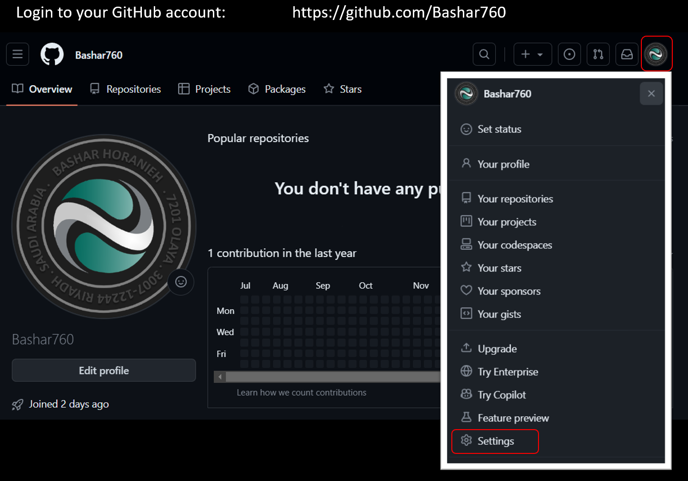
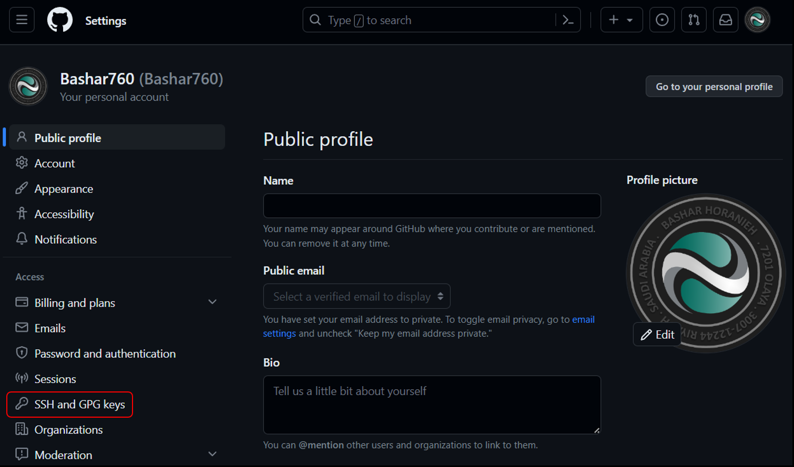
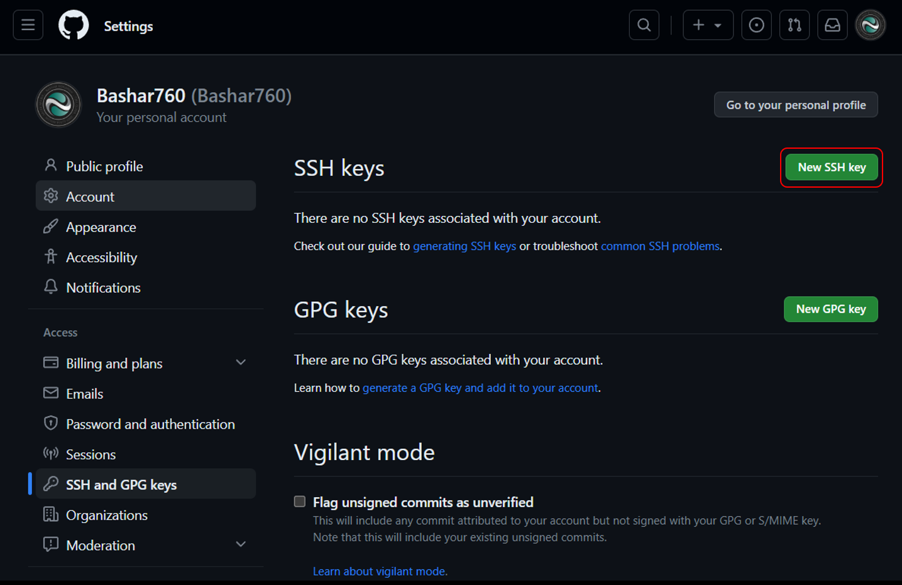
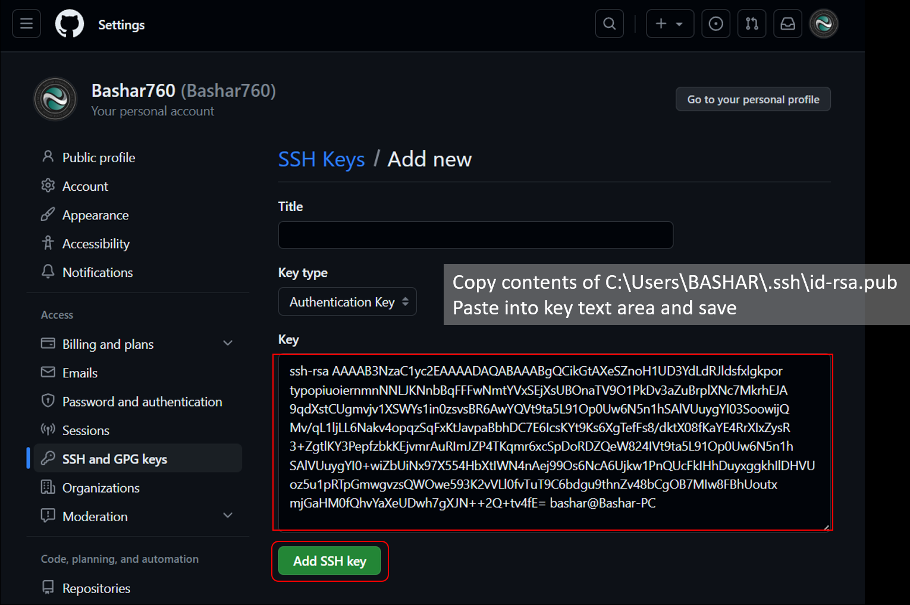

# flask-demo

> Following two commands will refresh the server automatically

```powershell
PS D:/flask/> set FLASK_ENV=development
PS D:/flask/> set FLASK_App=app.py
```

[Video](https://www.youtube.com/watch?v=3O4ZmH5aolg&list=PLCC34OHNcOtolz2Vd9ZSeSXWc8Bq23yEz&index=3)

## Setting up source control using GitHub

1 - Deactivate virtual environment

```powershell
(venv) PS D:\flask> deactivate
```

2 - Change to USER directory

```powershell
PS D:/flask/> cd ~
PS C:/Users/BASHAR>
```

3 - Create Hidden Secure Shell Directory

```powershell
PS C:/Users/BASHAR> md .ssh
PS C:/Users/BASHAR> cd .ssh
```

4 - Generate SSH private and public keys <span style='color:red'>(ignore password)</span>

```powershell
PS C:/Users/BASHAR/.ssh> ssh-keygen.exe
```

<pre>
Generating public/private rsa key pair.
Enter file in which to save the key (C:/Users/BASHAR/.ssh/id_rsa):
Enter passphrase (empty for no passphrase):
Enter same passphrase again:
Your identification has been saved in C:/Users/BASHAR/.ssh/id_rsa.
Your public key has been saved in C:/Users/BASHAR/.ssh/id_rsa.pub.
The key fingerprint is:
SHA256:r2QQvWthzQwIsWBSamsadffgdsWaMzAsx/TLk4XHcQ bashar@Bashar-PC
The key's randomart image is:
+---[RSA 3072]----+
|B. oo.o.         |
| #.  o E         |
|==* + + +        |
|=.o+ o o *       |
| o.   o S +      |
|. .+ o o +       |
| oo o   = .      |
|.  .   + .       |
|        .        |
+----[SHA256]-----+
</pre>

```powershell
PS C:/Users/BASHAR/.ssh> dir
```

<pre>
    Directory: C:/Users/BASHAR/.ssh

        Mode    LastWriteTime       Length  Name
        ----    -------------       ------  ----
        -a--    17/07/2023 7:29 PM  2602    id_rsa
        -a--    17/07/2023 7:29 PM  571     id_rsa.pub
</pre>

```powershell
PS C:/Users/BASHAR/.ssh> cat id_rsa.pub
```

<pre>
ssh-rsa AAAAB3NzaC1yc2EAAAADAQABAAABgQCikGtAXeSZnoH1UD3Yd
LdRJldsfxlgkportypopiuoiernmnNNLJKNnbBqFFFwNmtYVxSEjXsUBO
naTV9O1PkDv3aZuBrplXNc7MkrhEJA9qdXstCUgmvjv1XSWYs1in0zsvs
BR6AwYQVt9ta5L91Op0Uw6N5n1hSAlVUuygYI03SoowijQMv/qL1ljLL6
Nakv4opqzSqFxKtJavpaBbhDC7E6IcsKYt9Ks6XgTefFs8/dktX08fKaY
E4RrXIxZysR3+ZgtlKY3PepfzbkKEjvmrAuRImJZP4TKqmr6xcSpDoRDZ
QeW824IVt9ta5L91Op0Uw6N5n1hSAlVUuygYI0+wiZbUiNx97X554HbXt
IWN4nAej99Os6NcA6Ujkw1PnQUcFkIHhDuyxggkhIlDHVUoz5u1pRTpGm
wgvzsQWOwe593K2vVLl0fvTuT9C6bdgu9thnZv48bCgOB7MIw8FBhUout
xmjGaHM0fQhvYaXeUDwh7gXJN++2Q+tv4fE= bashar@Bashar-PC
</pre>

> Copy contents to use it for setting up GitHub account

> Create an .gitignore file to ignore all unneeded files and folders

<pre>
.gitignore
venv/
.vscode/
__pycache__
presentation1.pptx
</pre>

## Setup Git for Version Control on GitHub

### Login and create an SSH key






### Create repository




Activate environment again then run the following commands:

```html
(venv) PS D:\flask> git config --global user.name "Bashar" 
(venv) PS D:\flask> git config --global user.email "bashar750@gmail.com" 
(venv) PS D:\flask> git config --global push.default matching 
(venv) PS D:\flask> git config --global alias.co checkout 
(venv) PS D:\flask> git init
```

> Turn on Version Control

```
(venv) PS D:\flask> git add .
(venv) PS D:\flask> git commit -am "Initial commit"
```

You can push an existing repository from the command line

> Note: <br>Run the following command if you received the following error message error: remote origin already exists.

```
(venv) PS D:\flask> git remote remove origin
```

```
(venv) PS D:\flask> git remote add origin https://github.com/Bashar760/flask-demo.git
(venv) PS D:\flask> git branch -M main
(venv) PS D:\flask> git push -u origin main
```

> Commit changes as needed:

```
(venv) PS D:\flask> git add .
(venv) PS D:\flask> git commit -am "Modified app.py"
(venv) PS D:\flask> git push
```

> Document history

````
(venv) PS D:\flask> Get-History | Export-Csv history.csv
(venv) PS D:\flask> Get-History | Out-File history.txt ```
````
